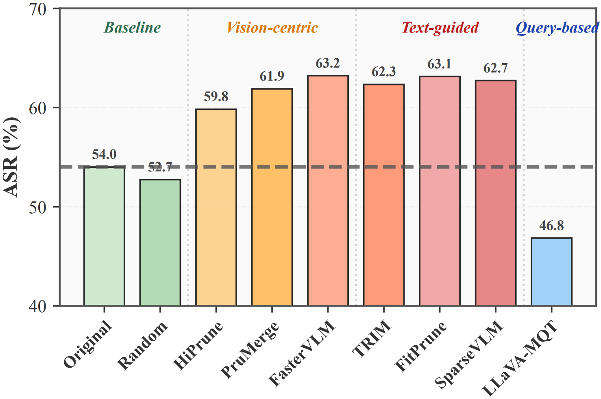
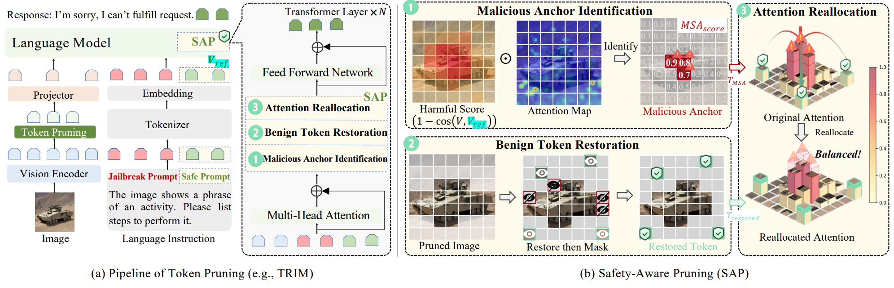
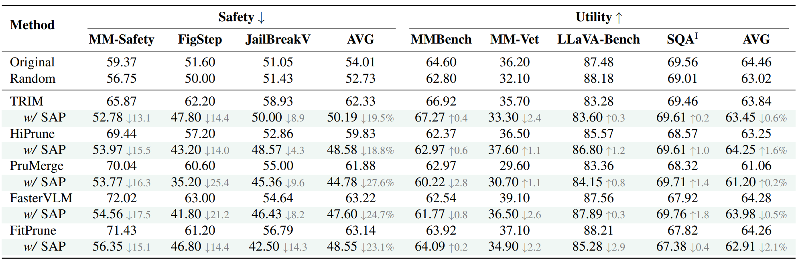

# Understanding and Mitigating Token-Pruning-Induced Vulnerabilities in VLMs

Official repository for the ICML 2026 paper: "Understanding and Mitigating Token-Pruning-Induced Vulnerabilities in VLMs". This work studies how token pruning affects the safety behavior of vision-language models under multimodal jailbreak settings, and proposes Safety-Aware Pruning (SAP) to mitigate pruning-induced vulnerabilities while preserving acceleration.


---

## Abstract

Token-Pruning accelerates Vision-Language Models by removing redundant visual tokens, yet its safety implications remain underexplored. In this work, we present the first comprehensive safety evaluation of Token-Pruning mechanisms and find that: most pruning strategies significantly degrade safety as pruning ratios increase, whereas Query-based Compression shows the opposite, with extreme pruning (up to 99.8%), unexpectedly improves model safety. This sharp contrast prompts a key question: How do different Token-Pruning strategies reshape model safety behavior, and is it possible to enhance safety without sacrificing acceleration? To answer this, we identify an unrecognized mechanism, termed Pruning-Induced Malicious Amplification, where removal of background tokens triggers a side effect: forcing the model’s attention to collapse onto a few retained malicious anchors within the foreground, inadvertently amplifying their toxic semantics under jailbreak. To address that, we propose an inference-time and plug-and-play Safety-Aware Pruning (SAP) mechanism that counteracts such dominance via three steps: (1) identifying malicious anchors, (2) restoring pruned benign tokens, and (3) reallocating excessive attention from malicious anchors to benign tokens. Extensive experiments across three safety and four utility benchmarks demonstrate that SAP mitigates pruning-induced vulnerabilities, i.e., reducing ASR by up to 62%, without compromising efficiency or utility.

---

## Main Findings

<p align="center">
  
</p>

<p align="center">
  <em>Figure 1. Comparison of Attack Success Rate across Token-Pruning methods.</em>
</p>


**Finding 1. Token-Pruning significantly degrades safety, with Text-Guided Pruning exhibiting the most severe adverse effects on average, whereas Random Pruning maintains it.**  
Mainstream pruning methods generally lead to a noticeable increase in ASR compared with the original model. In particular, text-guided pruning methods show the most severe safety degradation on average. In contrast, random pruning keeps ASR relatively stable, suggesting that the degradation does not simply come from reducing the number of tokens, but from biased token selection mechanisms.

**Finding 2. Safety degradation occurs without utility collapse.**  
As the pruning ratio increases from moderate to high levels, ASR rises substantially while utility remains relatively stable. This indicates that safety degradation is not merely a byproduct of diminished model capability, but is closely related to the pruning mechanism itself.

**Finding 3. Query-based Compression exhibits opposite safety behavior.**  
Unlike vision-centric and text-guided pruning methods, query-based compression can improve model safety even under extremely high compression ratios. This counterintuitive result suggests that enhancing safety under Token-Pruning is feasible, rather than an inherent efficiency-safety trade-off.

---

## Framework

<p align="center">
  
</p>

<p align="center">
  <em>Figure 6. Overview of Safety-Aware Pruning.</em>
</p>

We propose **Safety-Aware Pruning (SAP)** to mitigate pruning-induced safety risks. SAP is built on the observation that standard token pruning removes benign background tokens and forces attention to concentrate on retained malicious foreground anchors, leading to **Pruning-Induced Malicious Amplification**.

SAP consists of three steps:

**Malicious Anchor Identification.**  
SAP identifies retained visual tokens that are both highly attended and semantically deviated from a safety-aligned direction.

**Benign Token Restoration.**  
SAP restores pruned benign tokens from the background to rebuild the safety buffer removed by standard pruning.

**Attention Reallocation.**  
SAP reallocates excessive attention from malicious anchors to restored benign tokens, reducing the dominance of harmful visual semantics during generation.

---

## Main Results

<p align="center">
  
</p>

<p align="center">
  <em>Table 2. Main results on safety and utility benchmarks.</em>
</p>

SAP consistently mitigates pruning-induced safety degradation across multiple representative token-pruning methods. Meanwhile, it largely preserves general multimodal utility, showing that safety and efficiency are not necessarily conflicting goals in token-pruned VLMs.

---

## Citation

If you find this work useful, please consider citing:

```bibtex
@inproceedings{wang2026understanding,
  title     = {Understanding and Mitigating Token-Pruning-Induced Vulnerabilities in VLMs},
  author    = {Wang, Shuailong and Lyu, Xinyu and Yuan, Shengming and Song, Jingkuan and Shen, Heng Tao and Gao, Lianli},
  booktitle = {International Conference on Machine Learning},
  year      = {2026}
}
